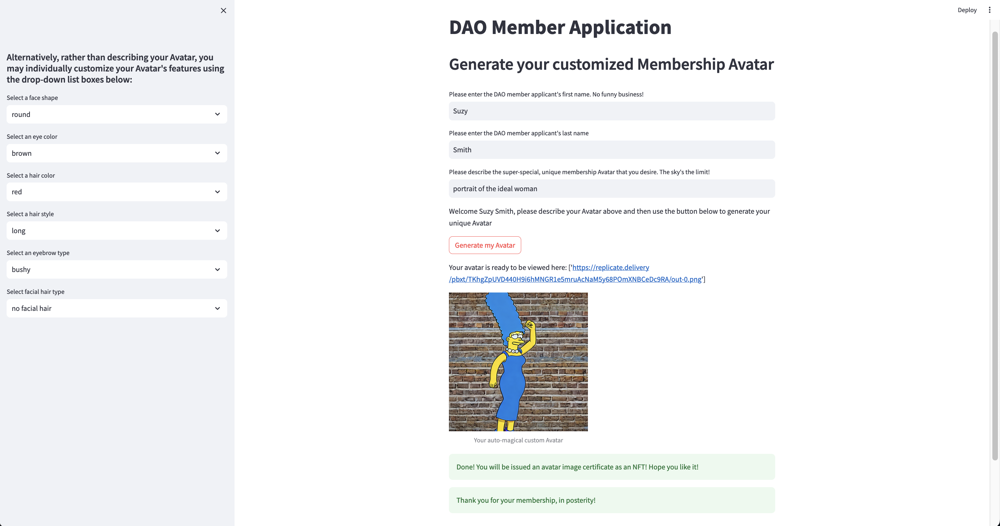
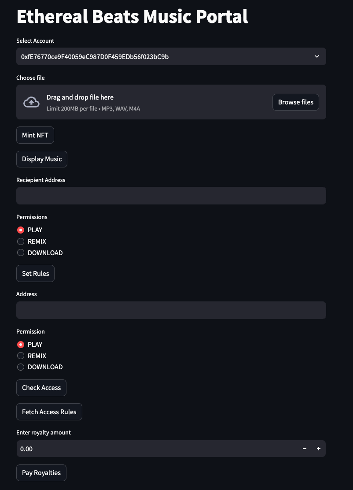

 # Ethereal Beats 

## Overview 

Ethereal Beats is not just another music platform; it's a legitimate paradigm shift poised to revolutionize the music industry with its decentralized music metaverse. By leveraging blockchain, virtual reality (VR), and NFTs, Ethereal Beats addresses key challenges faced by artists and fans around the world, introducing a new era of creativity and transparency.

We presented our findings on November 29, 2023 to the `Columbia Engineering FinTech Bootcamp 2023-06` cohort remotely via Zoom.

## Features 

* [Decentralized Governance](#decentralized-governance)
* [Machine Learning Generative AI Avatar](#machine-learning-generative-ai-avatar)
* [Ethereal Beats Portal Demo](#ethereal-beats-portal-demo)
* [Development Environment](#development-environment)
* [Code and Presentation Files](#code-and-presentation-files)
* [Team Information](#team-information)

## Technology Stack 

### Languages 
- Solidity
- Pyhton

### Front End 
- Streamlit
- IPFS
- Pinata

## Libraries
- Web3 
- Python Replicate
- OS
- dotenv
- bitarry
- JSON
- OppenZepplin - ERC721 (Inheritance)
- pinata.py (custom)

## Applications & Tools 
- Ganache - Local Blockchain 
- Goerli - Testnet 
- MetaMask

## Development Environment
- Remix IDE
- VScode
- Python Version 3.10.12
- git version 2.34.1
- Google Colab Jupyter Notebook 6.5.5

## Decentralized Governance 

** The DAO in Ethereal Beats serves as a governance backbone artist and fans actively participate in decision-making, empowering the community and creating and creating a collaborative environment for shaping the platform. 

## Machine Learning Generative AI Avatar 

** Through Generative AI, users, artist and fans can create a unique digital persona (avatar) for self-expression

** Avatars can attend virtual concerts on behalf of users, providing a realistic concert experience even from the comfort of their homes 

## Ethereal Beats Portal Demo 

** Manage Access Control Rules Over Music Usage

** Receive Transparent Streaming Royalties in Real Time 

### Development Environment

* Python Version 3.10.12
* Git version 2.34.1
* Google Colab Jupyter Notebook 6.5.5

## Code and Presentation Files
1. [`GitHub Project Repository`](https://github.com/bryantbeckford/EtherealBeats-Project-3/tree/main)
    
2. [`Ethereal Beats Smart Contracts`](https://github.com/boz-tcm/happiness_atlas/blob/master/Project_2_Neural_Nets.ipynb](https://github.com/bryantbeckford/EtherealBeats-Project-3/tree/main/Smart%20Contracts))
    
3. [`Ethereal Beats Presentation`](https://github.com/bryantbeckford/EtherealBeats-Project-3/tree/main/Presentaton%20Deck)

4. [`Ethereal Beats Compiled Smart Contract`](https://github.com/bryantbeckford/EtherealBeats-Project-3/tree/main/Compiled%20)

5. [`Ethereal Beats Images`](https://github.com/bryantbeckford/EtherealBeats-Project-3/tree/main/Images0) 

## Team Information

Group 2 - Team Ether 

**Team Members**: Bryant Beckford, Todd Meier, Jordi Salas 
